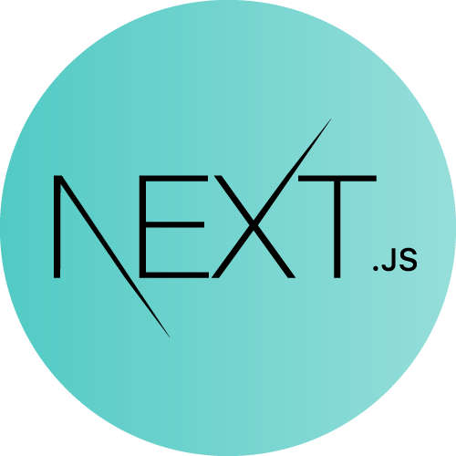

<div align="center">
	
	<h2 align="center">WaveChat</h2>
	<h5 align="center">
		A Real Time Social Media Platform
	</h5>
</div>

<details open>
	<summary>Table of Contents</summary>
	<ol>
		<li>
			<a href="#about-the-project">About The Project</a>
			<ul>
				<li><a href="#preview">Project Preview</a></li>
				<li><a href="#built-with">Built With</a></li>
			</ul>
		</li>
		<li>
			<a href="#getting-started">Getting Started</a>
			<ul>
				<li><a href="#prerequisites">Prerequisites</a></li>
				<li><a href="#clone-the-repository">Clone the repository</a></li>
			</ul>
		</li>
		<li><a href="#usage">Usage</a></li>
		<li><a href="#run-in-production-mode">Run in production mode</a></li>
		<li><a href="#run-in-development-mode">Run in development mode</a></li>
		<li><a href="#initialize-aws-s3-bucket">Initialize AWS S3 bucket</a></li>
		<li><a href="#browse-the-app">Browse the app</a></li>
		<li><a href="#license">License</a></li>
		<li><a href="#contact">Contact</a></li>
	</ol>
</details>

## About The Project

WaveChat is a real time social media application made for college/university students. In the recent couple years, the covid-19 pandemic has changed how students of all level interact with each other. It has been really tough for students to meet new people and make friends over the internet. This app was made for students to find other students of similar interest and make new friends. It also makes it easy for students of a certain course or section to communicate with each other about their activities and help each other.

### Preview

<div align="center">
	
	
	
	
	
</div>

## Built With

<table align="center" width="800">
	<tr>
		<td align="center" ><a href="https://www.typescriptlang.org"><br /><b><font color="#777">TypeScript</font></b></a></td>
		<td align="center"><a href="https://nextjs.org/"><br /><b><font color="#777">NextJs</font></b></a></td>
		<td align="center"><a href="https://reactjs.org"><br /><b><font color="#777">ReactJs</font></b></a></td>
		<td align="center"><a href="https://www.apollographql.com/"><br /><b><font color="#777">Apollo</font></b></a></td>
		<td align="center"><a href="https://tailwindcss.com/"><br /><b><font color="#777">Tailwind CSS</font></b></a></td>
		<td align="center"><a href="https://graphql.org/"><br /><b><font color="#777">GraphQL</font></b></a></td>
		<td align="center"><a href="https://giraphql.com/"><br /><b><font color="#777">GiraphQL</font></b></a></td>
	</tr>
		<td align="center"><a href="https://socket.io"><br /><b><font color="#777">Socket</font></b></a></td>
		<td align="center"><a href="https://nodejs.org/en/"><br /><b><font color="#777">NodeJs</font></b></a></td>
		<td align="center"><a href="https://www.prisma.io/"><br /><b><font color="#777">Prisma</font></b></a></td>
		<td align="center"><a href="https://www.postgresql.org/"><br /><b><font color="#777">PostgreSQL</font></b></a></td>
		<td align="center"><a href="https://redis.io/"><br /><b><font color="#777">Redis</font></b></a></td>
		<td align="center"><a href="https://www.docker.com/"><br /><b><font color="#777">Docker</font></b></a></td>
		<td align="center"><a href="https://aws.amazon.com/s3"><br /><b><font color="#777">AWS S3</font></b></a></td>
	</tr>
</table>

## Getting Started

#### Prerequisites

-   [Node.js](https://nodejs.org/en/)
-   [Pnpm](https://pnpm.io/installation)
-   [Docker](https://docs.docker.com/get-docker/)
-   [Docker-Compose](https://docs.docker.com/compose/install/)
-   [Git](https://git-scm.com/downloads)
-   [AWS-CLI](https://github.com/localstack/awscli-local)

#### Clone the repository

```bash
git clone https://github.com/FourLineCode/wavechat.git
```

## Usage

#### Run in production mode

```bash
pnpm deploy
```

> Make sure to install dependencies with `pnpm dep` command before deploy.

#### Run in development mode

```bash
pnpm dev
```

> Make sure to install dependencies with `pnpm dep` command before development.\
> Development runs docker containers in the background. Run `pnpm down` to stop the containers.

#### Initialize AWS S3 bucket

```bash
awslocal --endpoint-url=http://localhost:4566 s3 mb s3://wc-media
awslocal --endpoint-url=http://localhost:4566 s3api put-bucket-acl --bucket wc-media --acl public-read
```

> This is only applicable to local development.\
> Use the actual AWS cli or web control panel to initialize AWS S3 bucket in production.

#### Browse the app

-   **Frontend - [http://localhost:3000](http://localhost:3000)**
-   **GraphQL Playground - [http://localhost:5000/graphql](http://localhost:5000/graphql)**

## License

Published and distributed under the MIT License. See `LICENSE` for more information.

## Contact

Email - [akmal3535.ah@gmail.com](https://mail.google.com/mail/?view=cm&fs=1&to=akmal3535.ah@gmail.com&su=%23Issue@Wavechat:&body=Your%20Issue%20Here) \
Twitter - [@FourLineCode](https://twitter.com/FourLineCode) \
Facebook - [Akmal Hossain](https://facebook.com/FourLineCode)
