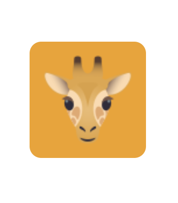

# WaveChat

**This is a Real Time Chat Application**

- Preview - [WaveChat (Coming Soon)](#)

This is a real time chat app made for college/university students. In the recent couple years, the covid-19 pandemic
has changed how students of all level interact with each other. It has been really tough for students
to meet new people and make friends over the internet. This app was made for students to find other students
of their similar level and make new friends. It also makes it easy for students of a certain course or section to
communicate with each other about their activities and help each other.

## Stack

<table align="center" width="500">
  <tr>
    <td align="center" ><a href="https://www.typescriptlang.org/vops"><br /><b><font color="#777"> TypeScript</font></b></a></td>
    <td align="center"><a href="https://nextjs.org/"><br /><b><font color="#777"> NextJs</font></b></a></td>
    <td align="center"><a href="https://reactjs.org"><br /><b><font color="#777"> ReactJs</font></b></a></td>
    <td align="center"><a href="https://www.apollographql.com/"><br /><b><font color="#777"> Apollo</font></b></a></td>
  </tr>
  <tr>
    <td align="center"><a href="https://tailwindcss.com/"><br /><b><font color="#777"> Tailwind CSS</font></b></a></td>
    <td align="center"><a href="https://graphql.org/"><br /><b><font color="#777"> GraphQL</font></b></a></td>
    <td align="center"><a href="https://socket.io"><br /><b><font color="#777"> Socket</font></b></a></td>
    <td align="center"><a href="https://nodejs.org/en/"><br /><b><font color="#777"> NodeJs</font></b></a></td>
  </tr>
  <tr>
    <td align="center"><a href="https://www.prisma.io/"><br /><b><font color="#777"> Prisma</font></b></a></td>
    <td align="center"><a href="https://www.postgresql.org/"><br /><b><font color="#777"> PostgreSQL</font></b></a></td>
    <td align="center"><a href="https://www.docker.com/"><br /><b><font color="#777"> Docker</font></b></a></td>
    <td align="center"><a href="https://giraphql.com/"><br /><b><font color="#777"> GiraphQL</font></b></a></td>
  </tr>
</table>

## If you want to run this application on your own follow the procedure below

## Requirements

- Node.js 14.0.0^
- Pnpm 6.0.0^
- Docker
- Docker-Compose
- Git

## Clone the Repository

```bash
git clone https://github.com/FourLineCode/wavechat.git
```

## Install Dependencies

```bash
pnpm --dir api install
pnpm --dir web install
```

> You can run these commands from the root directory as specified or change your directory if you want.

## Run development server

```bash
docker-compose up
```

> Pass the `--build` flag to rebuild the containers.

## Migrate database

```bash
pnpm --dir api migrate
```

> **This step is very important for the app to work**

## Visit the site at your local custom domain

- **Frontend [http://wavechat.localhost](http://wavechat.localhost)**
- **GraphQL Playground [http://wavechat.localhost/graphql](http://wavechat.localhost/graphql)**
